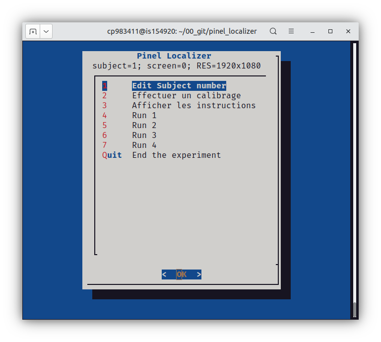

# Pinel Localizer 

This repository provides the "Pinel localizer", a 5-minute functional magnetic resonance imaging (fMRI) acquisition procedure which reliably captures the cerebral bases of key cognitive functions at an individual level, including auditory and visual perception, motor actions, reading, language comprehension, and mental calculation. 

Pinel P, Thirion B, Meriaux S, Jobert A, Serres J, Le Bihan D, Poline JB and Dehaene S. (2007).  Fast reproducible identification and large-scale databasing of individual functional cognitive networks. BMC Neuroscience, 8, 91.

Pinel P, Thirion B, Meriaux S, Jobert A, Serres J, Le Bihan D, Poline JB and Dehaene S. (2007). 
Fast reproducible identification and large-scale databasing of individual functional cognitive networks. BMC Neuroscience, 8, 91.

## Prerequisites

The `pinel_localizer.py` script requires the expyriment module (see [https://www.expyriment.org/](https://www.expyriment.org/))i which can be isnalled with:

    pip install expyriment

## Installation 

     cd <path_of_repository>
     git clone https://github.com/neurospin-stim/localizer_standard.git
     cd localizer-standard

* A video screen or video projector 
* Earphones for auditory stimuli
* Two response buttons, one for the left hand and one for the right hand.

## Running the protocol

First you must set three environment variables:

     export EXPYRIMENT_DISPLAY=0
     export EXPYRIMENT_DISPLAY_RESOLUTION=1920x1080
     export SUBJECT=10    # change to the correct value
 
Then you can launch the experiment through the menu:

     . menu_localizer.sh

Tihis will display the following dialog window:

At the end of the experiment, the details about the events can be found in the `data/*.xpd` files.

    
### Using the command line
The advanced level is the same as the basic level, but we detail the options. All documentation for the options are available by using:

    python pinel_localizer.py -h

In a few words, the script use a csv file in which the experimentater describes the stimuli.
Each line indicates the name of the stim (clicDaudio ...), the onset, the kind of stim (sound, rsvp ...) and the source (audio file, list of words ...).

The command for the localizer protocol with the options is:

    python pinel_localizer.py --background-color 0 0 0 --text-color 250 250 250 --rsvp-display-time=250 --rsvp-display-isi=100 --picture-display-time=200 --picture-isi=0 --fs_delay_time=100 --stim-dir stim_files  --total-duration=301000  --csv_file session1_localizer_standard.csv

The command for launching the instructions is:

    python pinel_localizer.py --background-color 0 0 0 --text-color 250 250 250 --rsvp-display-time=250 --rsvp-display-isi=100 --picture-display-time=200 --picture-isi=0 --fs_delay_time=100 --stim-dir stim_files  --total-duration=301000  --splash instructions_localizer.csv

The command for launching the calibration is:

    python pinel_localizer.py --background-color 0 0 0 --text-color 250 250 250 --rsvp-display-time=250 --rsvp-display-isi=100 --picture-display-time=200 --picture-isi=0 --fs_delay_time=100 --stim-dir stim_files  --total-duration=301000    --cali 1

The options for the localizer are: 

* --background-color 0 0 0 : color of the background
* --csv_file : file for stimulation
* --text-color 250 250 250 : color of the text
* --rsvp-display-time=250 : set the duration of display of single words in rsvp stimuli
* --rsvp-display-isi=100 : set the duration of display of single words in rsvp stimuli
* --picture-display-time=200 :  set the duration of display of pictures
* --picture-isi=0 : set the ISI between pictures in pictseq sequence
* --fs_delay_time=100 : time between the end of blanck screen and the beginning of fixation cross
* --stim-dir stim_files : directory in which stim are available
* --splash : csv file to propose the instructions
* --total-duration=301000 : all duration of the expyriment
* --cali : option to launch only the calibration

