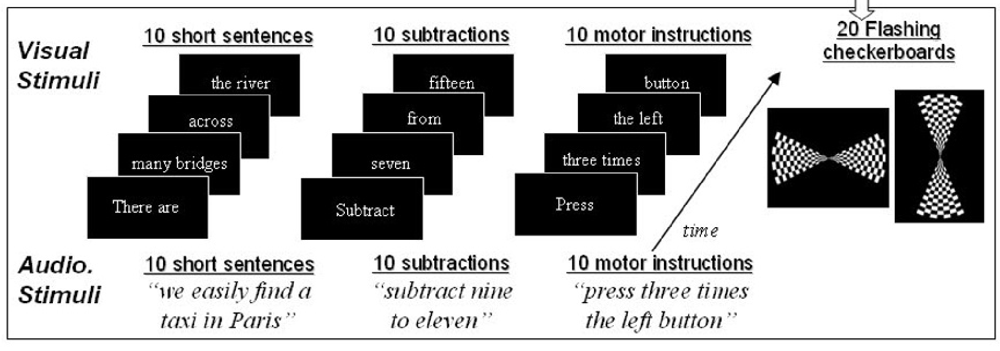

# Pinel Localizer 

This repository provides a script to run the _"Pinel localizer"_, a 5-minute functional magnetic resonance imaging (fMRI) stimulation protocol which reliably captures the cerebral bases of key cognitive functions at an individual level, including auditory and visual perception, motor actions, reading, language comprehension, and mental calculation. 

Reference:

Pinel, P., Thirion, B., Meriaux, S., Jobert, A., Serres, J., Le Bihan, D., Poline, J.-B., & Dehaene, S. (2007). Fast reproducible identification and large-scale databasing of individual functional cognitive networks. _BMC Neuroscience_, 8(1), 91. https://doi.org/10.1186/1471-2202-8-91

Note that the script `pinel_localizer.py` is adapted from [audiovis](https://github.com/chrplr/audiovis), a general purpose audiovisual stimulation framework.

## Prerequisites

The `pinel_localizer.py` script relies on the expyriment package (see [https://www.expyriment.org/](https://www.expyriment.org/)).

    pip install expyriment 

The `menu.py` script additionnaly require [nypscreen](https://npyscreen.readthedocs.io/).

    pip install nypscreen

### Hardware 

* A video screen or video projector 
* headphones for auditory stimuli
* Two response buttons, one for the left hand and one for the right hand, associated to 'b' and 'y' keypresses.
* The experiment waits for a 't' keypress event to start

## Running the protocol

To launch the experiment, run:

     python menu.py

Set the correct subject number, then you will be able to launch the instructions then the runs.
The cursor automatically increments its position after the exectution of a line, so you can just press a series 'Enter' to execute the whole thing.

4 runs with different random orders are availables. The corresponding event timings are in the files `session?*.csv`.

After running the experiment, the `data/*.xpd` files contain the actual timings, e.g., of keypress events.

Note: you may need to set the environement variables depending on your setup (one or multiple screens,  and the desired screen resolution)

     export EXPYRIMENT_DISPLAY=0   # screen where to display the stimuli
     export EXPYRIMENT_DISPLAY_RESOLUTION=1920x1080

     export SUBJECT=10    # subject id
    
### Using the command line

    

Examples:

    python pinel_localizer.py --background-color 0 0 0 --text-color 250 250 250 --rsvp-display-time=250 --rsvp-display-isi=100 --picture-display-time=200 --picture-isi=0 --fs_delay_time=100 --stim-dir stim_files  --total-duration=301000  --csv_file session1_localizer_standard.csv

The command for launching the instructions is:

    python pinel_localizer.py --background-color 0 0 0 --text-color 250 250 250 --rsvp-display-time=250 --rsvp-display-isi=100 --picture-display-time=200 --picture-isi=0 --fs_delay_time=100 --stim-dir stim_files  --total-duration=301000  --splash instructions_localizer.csv

The command for launching the calibration is:

    python pinel_localizer.py --background-color 0 0 0 --text-color 250 250 250 --rsvp-display-time=250 --rsvp-display-isi=100 --picture-display-time=200 --picture-isi=0 --fs_delay_time=100 --stim-dir stim_files  --total-duration=301000    --cali 1

    python pinel_localizer.py -h

The options for the localizer are: 

* --background-color 0 0 0 : color of the background
* --csv_file : file for stimulation
* --text-color 250 250 250 : color of the text
* --rsvp-display-time=250 : set the duration of display of single words in rsvp stimuli
* --rsvp-display-isi=100 : set the duration of display of single words in rsvp stimuli
* --picture-display-time=200 :  set the duration of display of pictures
* --picture-isi=0 : set the ISI between pictures in pictseq sequence
* --fs_delay_time=100 : time between the end of blanck screen and the beginning of fixation cross
* --stim-dir stim_files : directory in which stim are available
* --splash : csv file to propose the instructions
* --total-duration=301000 : all duration of the expyriment
* --cali : option to launch only the calibration

